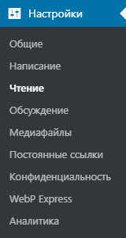
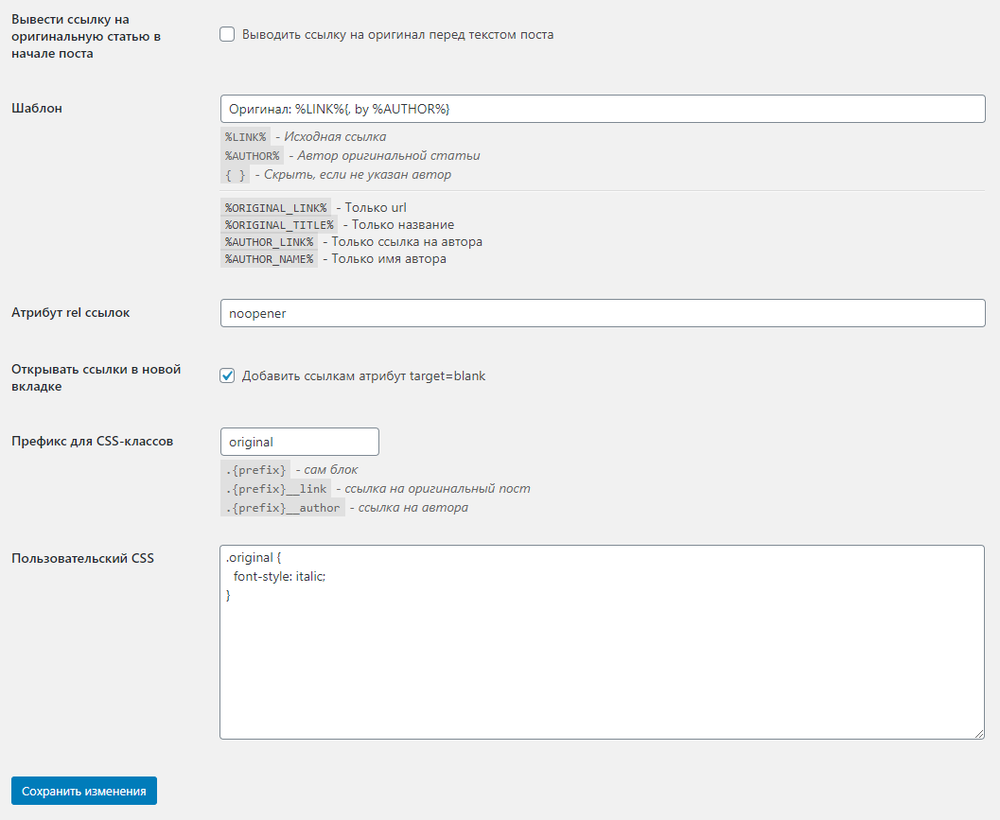
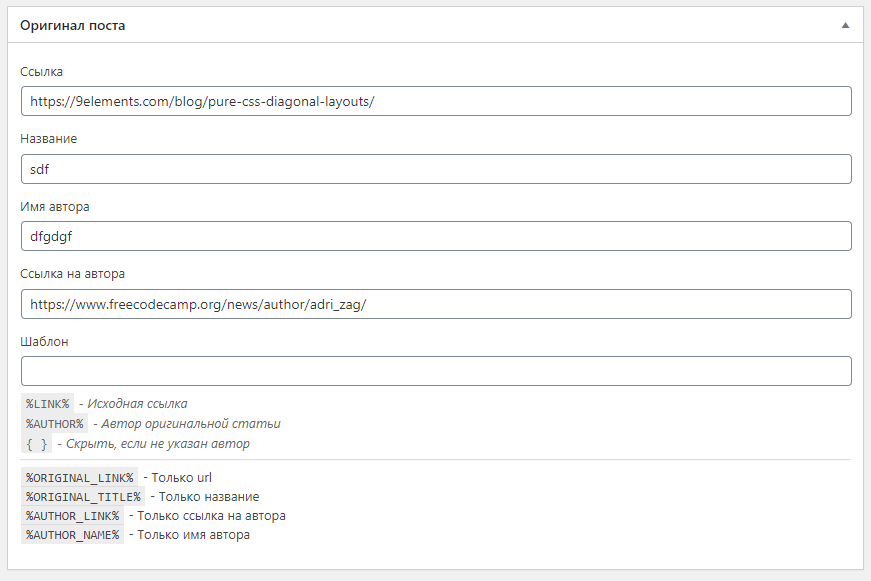

# Плагин Оригинальный пост

Выводит ссылку на оригинал для переводов статей.

## Глобальные настройки плагина

Настройки плагина находятся на странице Настройки->Чтение главного меню WordPress.

### Секция Оригинал поста

Опция|Эффект
-|-
Вывести ссылку на оригинальную статью в начале поста|Выводит блок перед контентом поста (по умолчанию - после)
Шаблон|Шаблонная строка с плейсхолдерами для вывода блока
Атрибут rel ссылок|Устанавливает значение атрибута <code>rel</code> для ссылок на оригинальный пост и автора
Открывать ссылки в новой вкладке|Добавляет ссылкам атрибут `target="_blank"`
Префикс для CSS-классов|Префикс для CSS-классов блока
Пользовательский CSS|Стили для блока. Будут выведены на странице поста, если для него заданы данные оригинальной статьи.

## Настройки для поста

* Ссылка на оригинальный пост
* Название оригинального поста
* Имя автора
* Ссылка на страницу автора
* Шаблон для вывода (Переопределяет глобальный)
